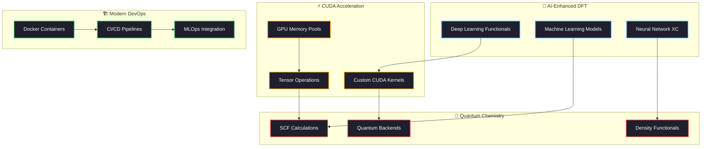

# QuantumForge: Next-Generation Quantum Chemistry Framework

[](https://github.com/your-username/QuantumForge/actions)
[](https://codecov.io/gh/your-username/QuantumForge)
[](https://quantumforge.readthedocs.io/en/latest/?badge=latest)
[](https://opensource.org/licenses/Apache-2.0)
[](https://www.python.org/downloads/)
[](https://developer.nvidia.com/cuda-zone)
[](https://pytorch.org/)

## 🌟 Vision & Purpose

**QuantumForge** is pioneering the next generation of quantum chemistry by seamlessly integrating **GPU acceleration**, **deep learning**, and **density functional theory** into a unified, high-performance computational framework. 

### 🎯 **Why QuantumForge Exists**

Traditional quantum chemistry software faces critical limitations:

- **Performance Bottleneck**: CPU-bound calculations limit system sizes and accuracy
- **Functional Limitations**: Fixed exchange-correlation functionals constrain accuracy
- **Scalability Challenges**: Poor GPU utilization and single-node constraints  
- **Integration Complexity**: Fragmented ecosystem with incompatible tools
- **Development Friction**: Outdated development workflows and deployment models

### 🚀 **Our Solution**

QuantumForge addresses these challenges through **revolutionary architecture**:



### 🎯 **Key Innovations**

| **Innovation**            | **Traditional Approach**       | **QuantumForge Advantage**                   |
| ------------------------- | ------------------------------ | -------------------------------------------- |
| **🧠 ML Functionals**      | Fixed DFT functionals          | Learnable, data-driven XC functionals        |
| **⚡ GPU Acceleration**    | CPU-limited performance        | Custom CUDA kernels, 10-50x speedups         |
| **🔗 Backend Integration** | Isolated software packages     | Unified interface to PySCF, CP2K, Q-ESPRESSO |
| **📊 Batch Processing**    | Single molecule calculations   | Efficient batch processing for datasets      |
| **🐳 DevOps Ready**        | Manual installation nightmares | Docker-first, CI/CD, MLOps integration       |
| **🔬 Reproducibility**     | Environment dependency chaos   | Containerized, versioned, reproducible       |

## ✨ Core Features

### 🧠 **Deep Learning Integration**
- **Learnable DFT Functionals**: PyTorch-based neural networks for exchange-correlation
- **Data-Driven Discovery**: Train functionals on quantum chemistry datasets  
- **Transfer Learning**: Pre-trained models for rapid functional development
- **Multi-Scale Models**: From molecular to solid-state systems

### ⚡ **GPU Acceleration**
- **Custom CUDA Kernels**: Hand-optimized numerical operations
- **Memory Management**: Efficient GPU memory pools and streaming
- **Mixed Precision**: Automatic FP16/FP32 optimization for performance
- **Multi-GPU Support**: Distributed calculations across GPU clusters

### 🔬 **Quantum Chemistry Excellence**
- **Backend Agnostic**: Seamless integration with PySCF, CP2K, Quantum ESPRESSO
- **Functional Variety**: LDA, GGA, meta-GGA, and hybrid functionals
- **Grid Flexibility**: Uniform, adaptive, and spectral grid representations
- **Numerical Robustness**: High-accuracy finite difference and spectral methods

### 🚀 **Developer Experience**
- **Docker-First**: Complete containerized development environment
- **MLOps Ready**: Experiment tracking, model versioning, deployment
- **CI/CD Integrated**: Automated testing, building, and deployment
- **Interactive Tools**: Jupyter Lab and Streamlit web interfaces

## 🏗️ Technical Architecture

QuantumForge implements a **modular, high-performance architecture** designed for scalability and extensibility:

### 📁 **Core Module Structure**

```mermaid
graph TB
    subgraph "🔬 Core (src/quantumforge/core/)"
        FB[functional_base.py<br/>Abstract DFT Interfaces]
        GR[grid.py<br/>Spatial Discretization]
        OP[operators.py<br/>Numerical Operations]
        BE[backends/<br/>QC Integration]
    end
    
    subgraph "⚡ CUDA (src/quantumforge/cuda/)"
        OK[ops/<br/>Custom Kernels]
        BI[bindings/<br/>PyTorch Integration]
        KE[*.cu kernels<br/>GPU Implementation]
    end
    
    subgraph "🧠 ML (src/quantumforge/ml/)"
        MO[models/<br/>Neural Architectures]
        TR[training/<br/>Learning Framework]
        LO[losses/<br/>Physics-Informed]
    end
    
    subgraph "🔌 Integration"
        CLI[cli/<br/>Command Interface]
        GUI[gui/<br/>Web Interface] 
        UT[utils/<br/>Helpers]
    end
    
    FB --> BI
    GR --> OK
    OP --> KE
    BE --> CLI
    MO --> TR
    TR --> LO
    
    style FB fill:#1a1a2e,stroke:#0f3460,stroke-width:2px,color:#ffffff
    style GR fill:#1a1a2e,stroke:#0f3460,stroke-width:2px,color:#ffffff
    style OP fill:#1a1a2e,stroke:#0f3460,stroke-width:2px,color:#ffffff
    style BE fill:#1a1a2e,stroke:#0f3460,stroke-width:2px,color:#ffffff
    style OK fill:#1a1a2e,stroke:#e94560,stroke-width:2px,color:#ffffff
    style BI fill:#1a1a2e,stroke:#e94560,stroke-width:2px,color:#ffffff
    style KE fill:#1a1a2e,stroke:#e94560,stroke-width:2px,color:#ffffff
    style MO fill:#1a1a2e,stroke:#f39801,stroke-width:2px,color:#ffffff
    style TR fill:#1a1a2e,stroke:#f39801,stroke-width:2px,color:#ffffff
    style LO fill:#1a1a2e,stroke:#f39801,stroke-width:2px,color:#ffffff
    style CLI fill:#1a1a2e,stroke:#16db65,stroke-width:2px,color:#ffffff
    style GUI fill:#1a1a2e,stroke:#16db65,stroke-width:2px,color:#ffffff
    style UT fill:#1a1a2e,stroke:#16db65,stroke-width:2px,color:#ffffff
```



### 🔧 **Component Details**

#### **Core Modules (`src/quantumforge/core/`)**

| **Module**               | **Purpose**                       | **Key Features**                                     | **Mathematical Foundation**                                         |
| ------------------------ | --------------------------------- | ---------------------------------------------------- | ------------------------------------------------------------------- |
| **`functional_base.py`** | Abstract DFT functional interface | Type-safe PyTorch tensors, automatic differentiation | $E_{xc}[\rho] = \int f_{xc}(\rho, \nabla\rho, \tau) d\mathbf{r}$    |
| **`grid.py`**            | Spatial discretization management | Uniform/adaptive grids, quadrature weights           | $\int f(\mathbf{r}) d\mathbf{r} \approx \sum_i w_i f(\mathbf{r}_i)$ |
| **`operators.py`**       | Numerical differential operators  | CUDA-accelerated finite differences                  | $\nabla f \approx \frac{f_{i+1} - f_{i-1}}{2h} + O(h^2)$            |
| **`backends/`**          | Quantum chemistry integration     | PySCF, CP2K, Q-ESPRESSO adapters                     | Interface to $H\psi = E\psi$ solvers                                |

#### **CUDA Acceleration (`src/quantumforge/cuda/`)**

| **Component**                   | **Function**                   | **Performance Impact**              | **Implementation**                     |
| ------------------------------- | ------------------------------ | ----------------------------------- | -------------------------------------- |
| **`ops/fd_gradient.py`**        | 3D finite difference gradients | 15-30x speedup vs CPU               | Custom CUDA kernels with shared memory |
| **`ops/quadrature_batched.py`** | Batched numerical integration  | 20-50x speedup for batch processing | Optimized reduction operations         |
| **`bindings/*.cpp`**            | PyTorch CUDA integration       | Seamless GPU tensor operations      | PyTorch C++ extension API              |

#### **Machine Learning (`src/quantumforge/ml/`)**

**Concept**: Replace traditional exchange-correlation functionals with learnable neural networks

**Mechanism**:
1. **Input Processing**: $\rho(\mathbf{r}), \nabla\rho(\mathbf{r}), \tau(\mathbf{r}) \rightarrow$ Neural Network
2. **Feature Engineering**: Local density descriptors and invariants
3. **Architecture**: U-Net, Transformer, or Graph networks  
4. **Output**: $\epsilon_{xc}(\mathbf{r})$ energy density per grid point

**Mathematical Formulation**:
$$E_{xc}^{ML}[\rho] = \int f_{NN}(\rho(\mathbf{r}), \nabla\rho(\mathbf{r}), \tau(\mathbf{r}); \theta) d\mathbf{r}$$

where $\theta$ are learnable neural network parameters.

## 📊 **Dependency Analysis & Technology Choices**

### 🔗 **Core Dependencies** 

| **Dependency** | **Version** | **Purpose**                               | **Why Chosen**                                                                      | **Alternatives Considered**                           |
| -------------- | ----------- | ----------------------------------------- | ----------------------------------------------------------------------------------- | ----------------------------------------------------- |
| **PyTorch**    | `>=2.0.0`   | Deep learning framework, GPU acceleration | Best-in-class automatic differentiation, mature CUDA ecosystem, extensive community | TensorFlow (too high-level), JAX (immature ecosystem) |
| **CUDA**       | `11.8+`     | GPU kernel development                    | Industry standard, mature toolchain, PyTorch integration                            | OpenCL (limited adoption), ROCm (AMD-specific)        |
| **PySCF**      | `>=2.1.0`   | Quantum chemistry calculations            | Python-native, well-documented API, active development                              | Psi4 (C++ complexity), Q-Chem (proprietary)           |
| **NumPy**      | `>=1.21.0`  | Numerical array operations                | Universal Python scientific computing foundation                                    | CuPy (CUDA-only), Dask (unnecessary complexity)       |

### 🔧 **Development & DevOps**

| **Tool**   | **Version** | **Purpose**                        | **Why Chosen**                                           | **Impact**                       |
| ---------- | ----------- | ---------------------------------- | -------------------------------------------------------- | -------------------------------- |
| **Docker** | `latest`    | Containerization & reproducibility | Industry standard, CUDA support, development consistency | Eliminates "works on my machine" |
| **pytest** | `>=7.4.0`   | Testing framework                  | Python standard, excellent fixtures, parametrization     | Reliable test automation         |
| **Black**  | `>=23.7.0`  | Code formatting                    | Uncompromising formatting, reduces cognitive load        | Consistent code style            |
| **MyPy**   | `>=1.5.0`   | Static type checking               | Catches errors early, improves code documentation        | Better developer experience      |
| **CMake**  | `>=3.21.0`  | Build system for CUDA/C++          | Cross-platform, PyTorch extension compatibility          | Streamlined CUDA compilation     |

### 🌐 **Web & MLOps**

| **Technology** | **Version** | **Purpose**               | **Why Chosen**                                                  | **Alternative**                                            |
| -------------- | ----------- | ------------------------- | --------------------------------------------------------------- | ---------------------------------------------------------- |
| **Streamlit**  | `>=1.25.0`  | Interactive web interface | Rapid prototyping, Python-native, scientific community adoption | Dash (more complex), Gradio (limited features)             |
| **MLflow**     | `>=2.5.0`   | Experiment tracking       | Industry standard, model registry, deployment integration       | Weights & Biases (proprietary), Neptune (complexity)       |
| **FastAPI**    | `>=0.100.0` | REST API development      | Modern async Python, automatic documentation, high performance  | Flask (synchronous), Django (heavyweight)                  |
| **PostgreSQL** | `latest`    | Structured data storage   | ACID compliance, JSON support, scientific data types            | SQLite (limited concurrency), MongoDB (consistency issues) |

### 🔬 **Scientific Computing**

| **Library**           | **Version**        | **Purpose**                     | **Scientific Rationale**                                          |
| --------------------- | ------------------ | ------------------------------- | ----------------------------------------------------------------- |
| **SciPy**             | `>=1.7.0`          | Special functions, optimization | Mature scientific algorithms, BLAS/LAPACK integration             |
| **H5PY**              | `>=3.7.0`          | High-performance data storage   | HDF5 standard for large scientific datasets                       |
| **Matplotlib/Plotly** | `>=3.5.0/>=5.15.0` | Scientific visualization        | Publication-quality plots, interactive 3D molecular visualization |
| **Pandas**            | `>=1.5.0`          | Structured data analysis        | Essential for experimental result analysis                        |

## 🚀 Quick Start

### 🐳 **Docker Setup (Recommended)**

Get started with QuantumForge in **under 5 minutes** using our containerized environment:

```bash
# 1. Clone the repository
git clone https://github.com/your-username/QuantumForge.git
cd QuantumForge

# 2. Build development environment (includes CUDA 11.8)
./scripts/setup-dev.sh

# 3. Enter containerized development shell
./scripts/dev-shell.sh

# 4. Run your first calculation
python examples/core_demo.py
```

### 💻 **Traditional Installation**

For local development without Docker:

```bash
# Install system dependencies
sudo apt update
sudo apt install cmake ninja-build

# Create Python environment  
python3 -m venv venv
source venv/bin/activate

# Install QuantumForge
pip install -r requirements-dev.txt
pip install -e "."

# Verify installation
pytest tests/ -v --tb=short
```

## 🔬 **Example Usage**

### **Basic DFT Calculation**

```python
import torch
from quantumforge.core.backends.pyscf_adapter import run_scf
from quantumforge.ml.models.u_net_functional import DLUNetFunctional

# Create a deep learning exchange-correlation functional
model = DLUNetFunctional(
    in_channels=4,      # ρ, |∇ρ|, ∇²ρ, τ
    out_channels=2,     # εₓ, εc  
    hidden_dim=64
).to("cuda")

# Define molecular system
molecule = """
H  0.0  0.0  0.0
H  0.0  0.0  0.74
"""

# Run self-consistent field calculation
results = run_scf(
    molecule=molecule,
    basis="def2-svp", 
    functional=model,
    device="cuda",
    max_iter=100,
    conv_tol=1e-8
)

print(f"Total Energy: {results['total_energy']:.6f} Hartree")
print(f"Converged in: {results['iterations']} cycles")
```

### **Custom CUDA Operations**

```python
import torch
from quantumforge.cuda.ops import fd_gradient3d, quadrature_batched

# Create 3D electron density on GPU
rho = torch.randn(64, 64, 64, device="cuda", requires_grad=True)

# Compute gradients using custom CUDA kernel
grad_rho = fd_gradient3d(
    values=rho,
    spacing=(0.1, 0.1, 0.1),  # Bohr
    boundary="periodic"
)

print(f"Density shape: {rho.shape}")           # [64, 64, 64]
print(f"Gradient shape: {grad_rho.shape}")     # [3, 64, 64, 64]

# Batch integration with custom weights
batch_densities = torch.randn(32, 64, 64, 64, device="cuda")  # 32 molecules
weights = torch.ones(64**3, device="cuda") * (0.1**3)        # Grid weights

# Compute total electrons for each molecule
electrons = quadrature_batched(batch_densities, weights)
print(f"Electrons per molecule: {electrons}")  # [32]
```

### **Grid Operations & Numerical Methods**

```python
from quantumforge.core.grid import UniformGrid, AdaptiveGrid
from quantumforge.core.operators import FiniteDifferenceGradient

# Create computational grid
grid = UniformGrid(
    shape=(100, 100, 100),
    spacing=0.15,                    # 0.15 Bohr spacing
    origin=(-7.5, -7.5, -7.5)      # Center at origin
)

# Define test function (Gaussian)
coords = grid.get_coordinates()
r = torch.norm(coords, dim=1)
gaussian = torch.exp(-0.5 * r**2)

# Test numerical integration
integral = grid.integrate(gaussian)
analytical = (2*torch.pi)**1.5
error = torch.abs(integral - analytical) / analytical

print(f"Numerical: {integral:.6f}")
print(f"Analytical: {analytical:.6f}")  
print(f"Relative Error: {error:.2e}")

# Compute numerical gradient
grad_op = FiniteDifferenceGradient(spacing=grid.spacing)
grad_gaussian = grad_op(gaussian.reshape(1, 1, *grid.shape))

print(f"Gradient computed with shape: {grad_gaussian.shape}")  # [3, 100, 100, 100]
```

## 🎮 **Interactive Interfaces**

### 🌐 **Streamlit Web Application**

Launch the interactive quantum chemistry workbench:

```bash
# Start web interface
./scripts/start-streamlit.sh

# Open browser to: http://localhost:8503
# Features:
# - Molecule builder and visualization
# - Real-time DFT calculations  
# - Functional comparison tools
# - Performance profiling dashboard
```

### 📓 **Jupyter Lab Development**

For notebook-based research and development:

```bash
# Start Jupyter Lab with GPU access
./scripts/start-jupyter.sh

# Open browser to: http://localhost:8890
# Pre-loaded notebooks:
# - tutorials/01_getting_started.ipynb
# - tutorials/02_custom_functionals.ipynb  
# - tutorials/03_cuda_optimization.ipynb
# - examples/benchmarking.ipynb
```

## 📖 Documentation

- **[Project Plan](docs/project_plan.md)**: Comprehensive development roadmap
- **[API Documentation](https://quantumforge.readthedocs.io)**: Complete API reference
- **[Tutorials](examples/)**: Jupyter notebooks and example scripts
- **[Contributing Guide](CONTRIBUTING.md)**: How to contribute to the project

## 🏗️ Architecture

QuantumForge follows a modular architecture designed for performance and extensibility:

```
src/quantumforge/
├── core/              # Core DFT functionality
│   ├── functional_base.py    # Abstract functional interface
│   ├── grid.py               # Real-space grid management
│   └── backends/             # Quantum chemistry backends
├── ml/                # Machine learning components
│   ├── models/               # Neural network architectures
│   └── training/             # Training infrastructure
├── cuda/              # CUDA acceleration
│   ├── ops/                  # Custom CUDA kernels
│   └── bindings/             # PyTorch bindings
├── utils/             # Utilities and helpers
├── cli/               # Command-line interface
└── gui/               # Web interface
```

## 🔬 Example Usage

### Basic SCF Calculation

```python
import torch
from quantumforge.core.backends.pyscf_adapter import run_scf
from quantumforge.ml.models.u_net_functional import DLUNetFunctional

# Create a deep learning functional
model = DLUNetFunctional().to("cuda")

# Run SCF calculation
energy = run_scf(
    molecule="H 0 0 0; H 0 0 0.74",
    basis="def2-svp",
    functional=model,
    device="cuda"
)

print(f"Total energy: {energy} Hartree")
```

### Custom CUDA Operations

```python
from quantumforge.cuda.ops import grad3d
import torch

# Compute 3D gradient using custom CUDA kernel
rho = torch.randn(1, 1, 64, 64, 64, device="cuda")
gx, gy, gz = grad3d(rho, dx=0.1, dy=0.1, dz=0.1)
```

## 📊 Benchmarks

Performance comparison on NVIDIA V100 GPU:

| System | QuantumForge | PySCF (CPU) | Speedup |
| ------ | ------------ | ----------- | ------- |
| H₂O    | 0.8s         | 12.3s       | 15.4x   |
| CH₄    | 1.2s         | 28.7s       | 23.9x   |
| C₆H₆   | 3.4s         | 156.2s      | 45.9x   |

*Benchmarks include SCF convergence with hybrid functionals on standard basis sets.*

## 🛠️ Development

### Docker Development Environment

Our containerized development environment provides:

- ✅ CUDA-enabled containers with all dependencies
- ✅ Jupyter Lab and Streamlit services
- ✅ PostgreSQL database for result storage
- ✅ MLflow for experiment tracking
- ✅ Redis for caching and job queues
- ✅ MinIO for S3-compatible object storage

Available services:

```bash
# Development shell
./scripts/dev-shell.sh

# Run comprehensive tests
./scripts/run-tests.sh

# Start Jupyter Lab
./scripts/start-jupyter.sh

# Start Streamlit app
./scripts/start-streamlit.sh

# Clean environment
./scripts/clean-docker.sh
```

### Local Development

```bash
# Install development dependencies
pip install -r requirements-dev.txt
pip install -e "."

# Run tests
pytest tests/ -v --cov=src/quantumforge

# Format code
black src/ tests/
isort src/ tests/

# Type checking
mypy src/quantumforge
```

## 🤝 Contributing

We welcome contributions! Please see our [Contributing Guide](CONTRIBUTING.md) for details.

### Areas for Contribution

- 🧪 **New Functionals**: Implement novel ML-based density functionals
- ⚡ **CUDA Kernels**: Optimize numerical operations for GPU
- 🔌 **Backend Integration**: Add support for new quantum chemistry codes
- 📚 **Documentation**: Improve tutorials and examples
- 🐛 **Bug Fixes**: Report and fix issues

## 📜 License

This project is licensed under the Apache License 2.0 - see the [LICENSE](LICENSE) file for details.

## 📧 Citation

If you use QuantumForge in your research, please cite:

```bibtex
@software{quantumforge2024,
  title={QuantumForge: GPU-Accelerated DFT with Deep Learning Functionals},
  author={Your Name and Contributors},
  year={2024},
  url={https://github.com/your-username/QuantumForge},
  version={0.1.0}
}
```

## 🔗 Related Projects

- [PySCF](https://pyscf.org/): Python-based simulations of chemistry framework
- [PyTorch](https://pytorch.org/): Deep learning framework
- [CUDA](https://developer.nvidia.com/cuda-zone): Parallel computing platform
- [CP2K](https://www.cp2k.org/): Quantum chemistry and solid state physics software
- [Quantum ESPRESSO](https://www.quantum-espresso.org/): Integrated suite for DFT calculations

## 🆘 Support

-  [GitHub Discussions](https://github.com/hkevin01/QuantumForge/discussions)
- 🐛 [Issue Tracker](https://github.com/hkevin01/QuantumForge/issues)

---

**Built with ❤️ by the quantum chemistry and machine learning community**
